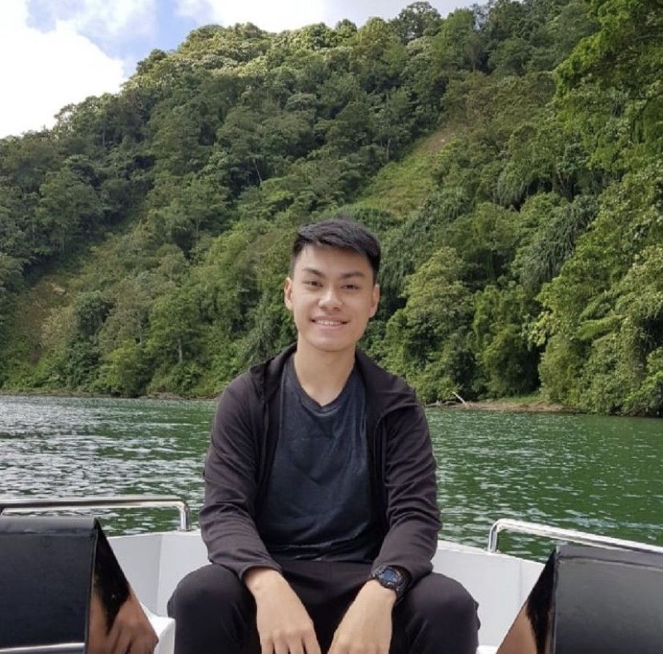

# Welcome to Niko Setiawan's Profile!

## My Bio

Hi, my name is Niko. Student of RevoU Software Engineering Program.

I'm a Software Engineering Student at RevoU, and I taught myself to code 1 month ago. I follow the curriculum on The Odin Project, a free open source coding curriculum that helps students get hired as software engineer.

I aim to get hired as a software engineer, as I believe the job isn't bound by location, and can be done from anywhere in the world. Well, except places without internet access.

I hope that i could find remote job as software engineer after graduating from RevoU, so wish me luck!

## My Links

- GitHub: [@nikosetiawanp](https://github.com/nikosetiawanp)
- Twitter: [@nikosetiawanp](https://twitter.com/nikosetiawanp)
- LinkedIn: [nikosetiawanp](https://www.linkedin.com/in/niko-sp-950001261/)

## My Technical Skills

1. Code Editor and VS Code
2. Markdown
3. Terminal and CLI
4. Git
5. GitHub

## My Favorite Websites

| Name           | URL                         | Reason                                               |
| -------------- | --------------------------- | ---------------------------------------------------- |
| Google         | <https://google.com>        | To search anything                                   |
| Stack Overflow | <https://stackoverflow.com> | To find solutions about code                         |
| Youtube        | <https://www.youtube.com>   | For entertainment and find solutions in video format |
| Pinterest      | <https://www.pinterest.com> | To find inspirations                                 |
| Behance        | <https://www.behance.net>   | To see other people's projects                       |
| Reddit         | <https://www.reddit.com>    | To see other people's opinion on some topics         |
